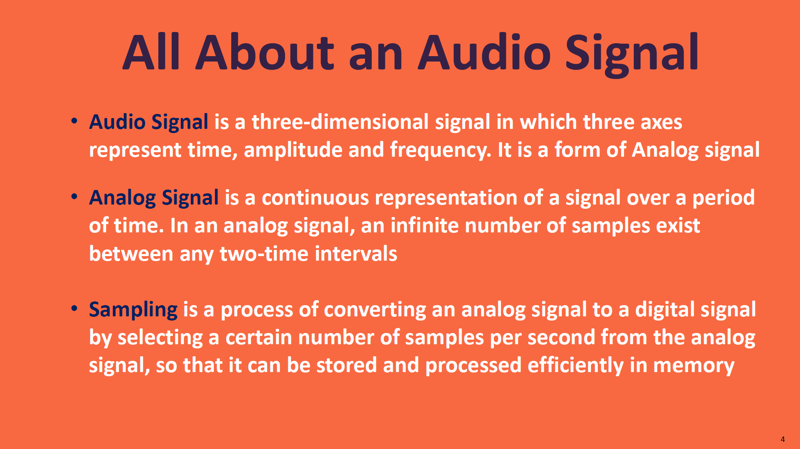
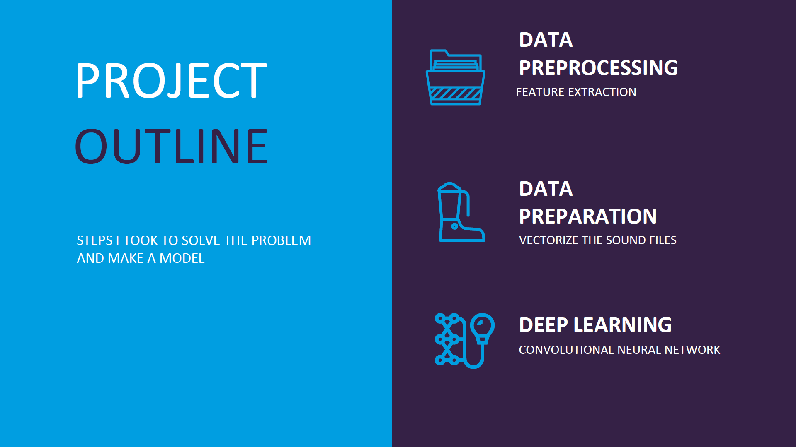
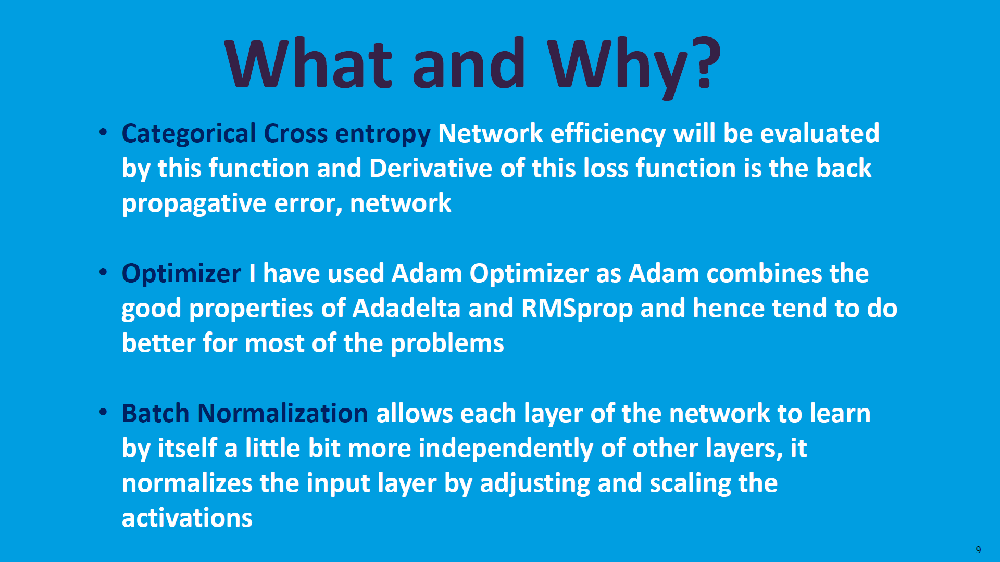
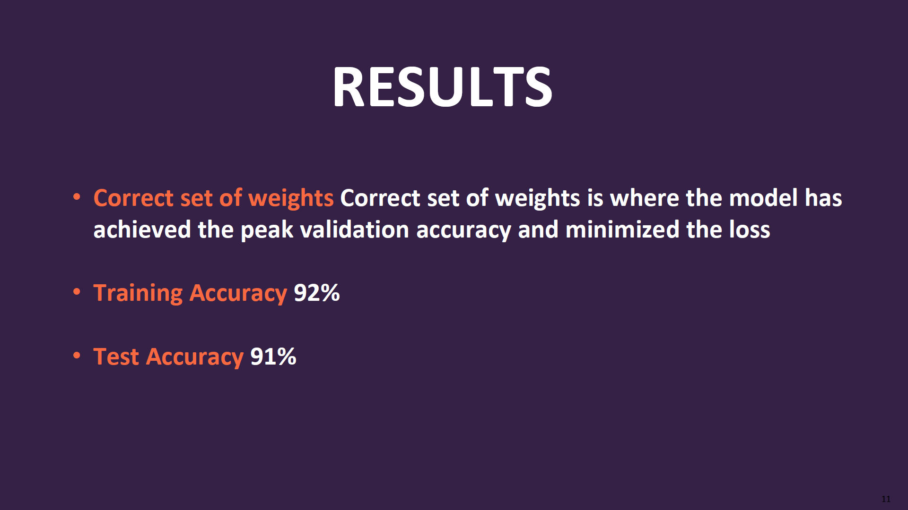

[](http://hits.dwyl.io/ashish1993utd/Speech-Recognition-System-using-Multi-Layer-Perceptron)

# Speech-Recognition-System-using-Multi-Layer-Perceptron
> A Speech Recognition system that recognizes all the digits spoken through 0 to 9.

## Screenshots






## Technologies and Tools
* Python 
* TensorFlow
* Keras
* Librosa
* Scipy

## Code Examples

````
# Reading the Audio Data

labels=os.listdir(train_audio_path)
labels = []
number_of_records = []
for f in os.listdir(train_audio_path):
    if f.endswith('.wav'):
        label = f.split('_')[0]
        labels.append(label)
        
label_dic={}
for i in labels:
    if i in label_dic:
        label_dic[i]+=1
    else:
        label_dic[i]=1

plt.bar(label_dic.keys(),label_dic.values())
plt.title('No. of recordings for each digit')
plt.xlabel('Digit', fontsize=12)
plt.ylabel('No of recordings', fontsize=12)
plt.show()
````

````
# Model Traiining using CNN

from keras.layers import Dense, Dropout, Flatten, Conv1D, Input, MaxPooling1D
from keras.models import Model
from keras.callbacks import EarlyStopping, ModelCheckpoint
from keras import backend as K
K.clear_session()

inputs = Input(shape=(8000,1))

conv = Conv1D(8,13, padding='valid', activation='relu', strides=1)(inputs)
conv = MaxPooling1D(3)(conv)
conv = Dropout(0.3)(conv)

conv = Conv1D(16, 11, padding='valid', activation='relu', strides=1)(conv)
conv = MaxPooling1D(3)(conv)
conv = Dropout(0.3)(conv)

conv = Conv1D(32, 9, padding='valid', activation='relu', strides=1)(conv)
conv = MaxPooling1D(3)(conv)
conv = Dropout(0.3)(conv)

conv = Conv1D(64, 7, padding='valid', activation='relu', strides=1)(conv)
conv = MaxPooling1D(3)(conv)
conv = Dropout(0.3)(conv)

conv = Flatten()(conv)

conv = Dense(256, activation='relu')(conv)
conv = Dropout(0.3)(conv)

conv = Dense(128, activation='relu')(conv)
conv = Dropout(0.3)(conv)

outputs = Dense(len(labels), activation='softmax')(conv)

model = Model(inputs, outputs)
model.summary()

````
## Status
Project is: _finished_. 

## Contact
If you loved what you read here and feel like we can collaborate to produce some exciting stuff, or if you
just want to shoot a question, please feel free to connect with me on 
<a href="mailto:hello@sharma-ashish.com">email</a> or 
<a href="https://www.linkedin.com/in/ashishsharma1993/" target="_blank">LinkedIn</a>

